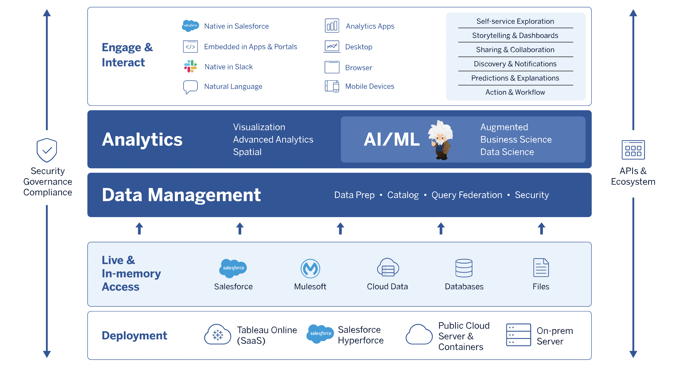

# Tableau REST API

Manage Tableau Server, Tableau Online, and Prep Conductor resources programmatically. Access data sources, projects, workbooks, site users, sites, flows, and more.

>This project contains OpenAPI descriptions of Tableau RESTful APIs for design and documentation purposes.
>
>[Click here to visit the documentation portal](https://prod-apsoutheast-a.online.tableau.com/).

